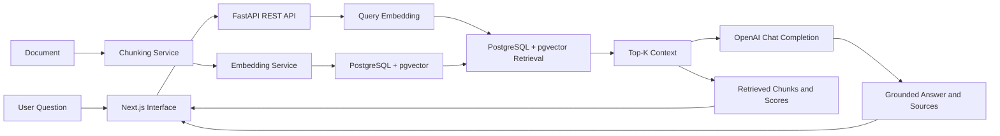

# ContextFlow

ContextFlow is a public-safe RAG knowledge assistant and educational reference implementation built to demonstrate how retrieval, embeddings, vector search, and grounded answer generation fit together in a full-stack application.

This is a portfolio and teaching project. It is not a production SaaS platform.

## Why This Project Exists

ContextFlow exists to make Retrieval-Augmented Generation easier to inspect, explain, and troubleshoot. It demonstrates:

- End-to-end RAG application architecture
- The difference between retrieval and generation
- Transparent inspection of retrieved chunks
- Source-grounded responses
- Full-stack AI application development
- Practical implementation tradeoffs

## What Someone Can Learn From It

- How manually entered documents become deterministic text chunks
- How chunks become embeddings through an embedding model
- How embeddings support semantic search in a vector database
- How top-K retrieval changes the amount of context returned
- How source filtering narrows the search space
- How retrieved context is passed to an LLM for grounded answer generation
- Why retrieval quality affects answer quality
- Why RAG improves grounding but does not guarantee correctness

## Architecture



The frontend is intentionally small and demo-focused. The backend keeps route handlers thin and places chunking, embeddings, retrieval, and answer generation behind service boundaries.

## RAG Process

### Indexing

1. Create a source.
2. Create a document with public-safe text.
3. Split the document into deterministic chunks.
4. Generate embeddings for each chunk.
5. Store chunks and vectors in PostgreSQL with pgvector.

### Retrieval and Generation

1. Receive a question.
2. Generate a query embedding.
3. Run similarity search over indexed chunks.
4. Return top-K chunks, optionally filtered to one source.
5. Optionally generate a grounded answer from the retrieved context.
6. Display retrieved sources, chunk metadata, and similarity scores.

## Demo Walkthrough

1. Start the app with `docker compose up --build`.
2. Optionally load demo sources and draft documents by setting `SEED_DEMO_DATA=true`.
3. Open `http://localhost:3000`.
4. Open a source from the Sources screen.
5. Inspect a document or create a new manual text document.
6. Click **Index document** to create chunks and embeddings.
7. Open the Ask screen and enter a question about indexed content.
8. Run **Retrieval Only** to inspect chunks and scores without answer generation.
9. Switch to **Grounded Answer** to compare the generated response against retrieved evidence.
10. Change top-K to compare how much context is returned.
11. Apply a source filter to show how retrieval scope affects results.
12. Review retrieved chunks, source titles, document titles, chunk IDs, and scores.

## Screenshots

Screenshot placeholders and capture instructions live in [docs/screenshots/README.md](docs/screenshots/README.md). The README will reference image files after screenshots are captured and committed, so it does not contain broken image links.

## Technical Stack

- **Next.js and React** provide the browser interface for source management, document inspection, indexing actions, ask controls, and saved session review.
- **TypeScript** keeps frontend API contracts and UI data shapes explicit.
- **Tailwind CSS** provides a compact, consistent visual system without a large component framework.
- **FastAPI** exposes a small REST API for sources, documents, retrieval, health checks, and ask sessions.
- **SQLAlchemy** models the source, document, chunk, and ask-session data model.
- **PostgreSQL** stores relational application data.
- **pgvector** stores embeddings and performs vector similarity search.
- **OpenAI embeddings** convert chunks and questions into vectors.
- **OpenAI chat completions** generate grounded answers from retrieved context.
- **Docker Compose** runs the web app, API, and database together for repeatable local demos.

## API Summary

- `GET /health` - API liveness check.
- `GET /stats` - dashboard counts.
- `GET /sources`, `POST /sources`, `GET /sources/{id}`, `PATCH /sources/{id}`, `DELETE /sources/{id}` - source management.
- `GET /documents`, `POST /documents`, `GET /documents/{id}`, `PATCH /documents/{id}`, `DELETE /documents/{id}` - document management.
- `POST /documents/{id}/index` - chunk and embed a document.
- `GET /documents/{id}/chunks` - inspect generated chunks.
- `POST /retrieve` - semantic retrieval with top-K and optional source filtering.
- `POST /ask` - retrieval-only or grounded-answer request.
- `GET /ask-sessions`, `GET /ask-sessions/{id}` - saved ask-session review.

## Local Setup

### Prerequisites

- Docker Desktop
- Node.js 20+ for local frontend checks outside Docker
- Python 3.11+ for local backend checks outside Docker
- An OpenAI API key for indexing, retrieval, and grounded answers

### Environment Setup

Backend:

```bash
cp apps/api/.env.example apps/api/.env
```

Set `OPENAI_API_KEY` in `apps/api/.env` or in your shell environment. Do not commit real keys.

Frontend:

```bash
cp apps/web/.env.example apps/web/.env
```

Docker Compose already sets `NEXT_PUBLIC_API_URL=http://api:8000` for the web container. The frontend `.env` file is mainly for non-Docker local runs.

### Start Docker

```bash
docker compose up --build
```

Open:

- Web app: `http://localhost:3000`
- API health: `http://localhost:8000/health`

Expected health response:

```json
{"status":"ok","service":"contextflow-api"}
```

### Demo Seed Option

Set this in `apps/api/.env` before startup:

```bash
SEED_DEMO_DATA=true
```

The seed creates public-safe demo sources and draft documents. You still need to index the seeded documents before retrieval can return embedded chunks.

### Shutdown

```bash
docker compose down
```

### Reset Data

```bash
docker compose down -v
docker compose up --build
```

This removes the local Postgres volume and recreates the database.

### Common Startup Errors

- Missing `OPENAI_API_KEY`: the app starts, but indexing/retrieval/answer generation return a clear API key error.
- Docker Desktop not running: Compose cannot start containers.
- Port `3000`, `8000`, or `5432` already in use: stop the conflicting local process or change Compose port mappings.
- API health fails: check the API container logs and confirm Postgres is healthy.
- Web app cannot reach API: confirm `NEXT_PUBLIC_API_URL` is set correctly for the runtime.

## Teaching and Workshop Use

ContextFlow can be used to demonstrate:

- RAG fundamentals
- Embeddings
- Vector retrieval
- Prompt grounding
- Source attribution
- Retrieval debugging
- Application architecture
- AI implementation tradeoffs

Workshop materials:

- [Workshop Guide](docs/WORKSHOP_GUIDE.md)
- [Lab Guide](docs/LAB_GUIDE.md)
- [Troubleshooting Guide](docs/TROUBLESHOOTING_GUIDE.md)
- [Interview Demo Guide](docs/INTERVIEW_DEMO_GUIDE.md)

## Limitations

- Manual text entry only
- No authentication
- No user accounts or multi-tenancy
- No file uploads
- No website crawling
- External OpenAI API dependency
- No production security hardening
- No comprehensive evaluation framework
- No guarantee of answer correctness

RAG can improve grounding by giving a model relevant context, but retrieval can miss evidence, return weak evidence, or surface text that is similar but not sufficient.

## Documentation Links

- [Project Overview](docs/PROJECT_OVERVIEW.md)
- [Architecture](docs/ARCHITECTURE.md)
- [RAG Model](docs/RAG_MODEL.md)
- [Technical Stack](docs/TECH_STACK.md)
- [Scope Guardrails](docs/SCOPE_GUARDRAILS.md)
- [Development Phases](docs/DEVELOPMENT_PHASES.md)
- [Portfolio Copy](docs/PORTFOLIO_COPY.md)
- [Repository Audit Report](docs/AUDIT_REPORT.md)
- [Workshop Guide](docs/WORKSHOP_GUIDE.md)
- [Lab Guide](docs/LAB_GUIDE.md)
- [Troubleshooting Guide](docs/TROUBLESHOOTING_GUIDE.md)
- [Interview Demo Guide](docs/INTERVIEW_DEMO_GUIDE.md)
- [Final Demo Cheat Sheet](docs/FINAL_DEMO_CHEAT_SHEET.md)
- [Screenshot Preparation](docs/screenshots/README.md)
- [Launch Checklist](docs/LAUNCH_CHECKLIST.md)

## What This Project Demonstrates

- AI application development with retrieval, embeddings, and grounded generation
- API integration with provider error boundaries
- RAG architecture from ingestion through answer generation
- Technical troubleshooting across frontend, backend, database, Docker, and external APIs
- Developer tooling for local verification and repeatable demos
- Full-stack engineering with clear service boundaries
- Responsible system boundaries that avoid production-readiness claims

## Public-Safe Disclaimer

This repo contains only generic demo content and public-safe code. Do not add private client data, proprietary code, confidential prompts, real API keys, or sensitive screenshots.
